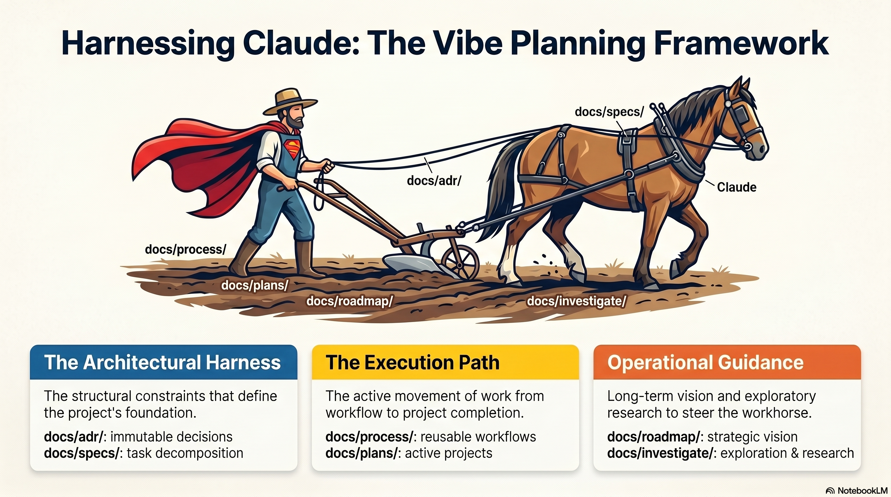

# Vibe Planning Demo Repo



This repository demonstrates a lightweight "vibe planning" workflow using:

- `docs/plans/*.md` files for implementation intent
- `docs/plans/TODO.md` as a live task checklist
- `.clinerules/` to encourage synchronization between plans and the TODO list
- incremental git commits to preserve an audit trail
- Docker Compose and a GPU-enabled container example on NVIDIA DGX Spark

## Workflow

1. Create or update a plan file in `docs/plans/<feature>.md`
2. Ask your coding assistant to implement the plan
3. Let the rules ensure `docs/plans/TODO.md` reflects the plan
4. Implement one task at a time
5. Update `docs/plans/TODO.md` as tasks are completed
6. Commit each meaningful step to git

## Bootstrapping the rules into another project

`scripts/link-clinerules.sh` symlinks a set of `.clinerules/*.md` files
into a target project's `.clinerules/` directory and regenerates the
`@`-import block in `~/.claude/CLAUDE.md`. Use it to give a new
repository the same rule set without copying files by hand.

### Use this repo's rules as the source

Bootstraps the target project from the rules shipped in
`./.clinerules/`:

```zsh
./scripts/link-clinerules.sh \
  --source=./.clinerules \
  /path/to/target-project
```

### Use your global `~/.clinerules/` as the source (default)

If you maintain personal global rules at `~/.clinerules/`, omit
`--source`:

```zsh
./scripts/link-clinerules.sh \
  /path/to/target-project
```

### Flags

- `--source=DIR` — directory to read rule files from (default
  `~/.clinerules/`).
- `--force` / `-f` — overwrite existing symlinks. Real files in the
  target are always skipped; remove them by hand to replace.

### Side effect: edits `~/.claude/CLAUDE.md`

The script also rewrites the managed `@`-import block in
`~/.claude/CLAUDE.md` (your personal Claude Code config) so the listed
rule files are imported globally. The block is delimited by sentinel
HTML comments; content outside the markers is preserved on subsequent
runs. If you do not want this side effect, comment out section 2 of
the script before running.