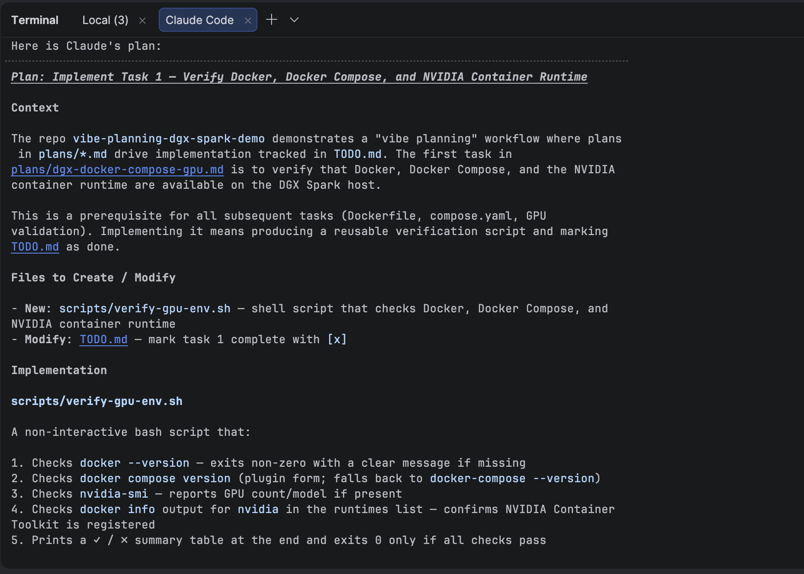
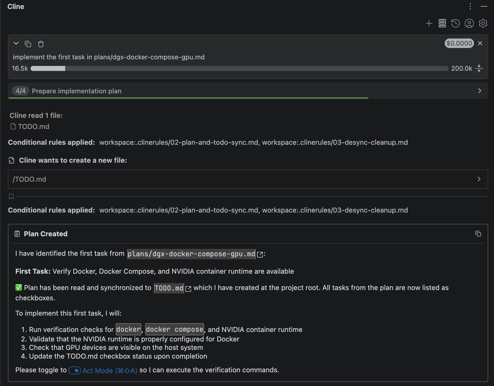
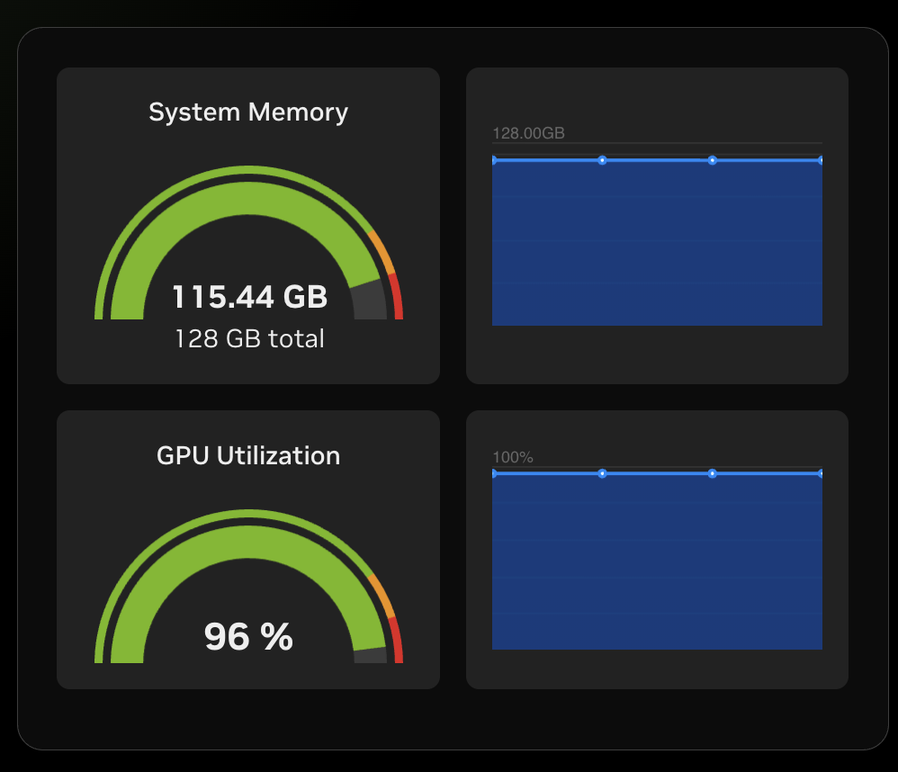

# Activating Vibe Planning From an Existing `docs/plans/`

> Draft for a Medium how-to. This file is gitignored
> (`.git/info/exclude`) and never lands on the `medium/howto` branch.
> The branch contains only the artifacts the workflow produces.

A "vibe planning" workflow uses a small set of `.clinerules/` files to
coordinate three things: a plan, a live checklist, and an AI coding
assistant working off both. This article walks through *activating*
that workflow against a repo that already has a plan but no
checklist — the most realistic starting point.

## What you'll have at the end

- A `docs/plans/<feature>.md` plan (already exists).
- A `docs/plans/TODO.md` whose sections, ordering, and checkbox states
  trace 1:1 to the plan.
- A clear loop for keeping the two files aligned as work progresses.

The repository for this walkthrough lives at
`https://github.com/msusol/vibe-planning-dgx-spark-demo`. Clone it
and switch to `medium/howto`:

```zsh
git clone git@github.com:msusol/vibe-planning-dgx-spark-demo.git
cd vibe-planning-dgx-spark-demo
git checkout medium/howto
```

## How this tutorial is structured

Each step in the tutorial is one commit on the `medium/howto`
branch. You can navigate them with `git log` and check out any
intermediate state with `git checkout <hash>`. Each step's section
below names the commit hash so you can jump to the matching diff.

```zsh
git log --oneline medium/howto
```

Steps so far:

- **Step 0** — starting state. `git checkout medium/howto~1` (or any
  earlier hash) lands here: plan file present, no `TODO.md`.
- **Step 1** — activate the workflow. Commit `d235753`.
- **Step 2** — complete Task 1: verify prerequisites. Commit `b89e18d`.
- **Step 3** — complete Task 2: create the Dockerfile. Commit `a7d7813`.
- **Step 4** — complete Tasks 3 & 4: compose.yaml, snap Docker investigation, ADR, GPU verified. Commit `f6a71d7`.
- **Step 5** — complete Task 5: GPU-backed workload, process doc gap discovered, new clinerule, all tasks done. Commit `a863be8`.

---

## Step 0 — Starting state

`git checkout medium/howto~1` lands you here. The relevant tree
looks like this:

```
.
├── .clinerules/
│   ├── 01-global.md                  # canonical docs/ folder roles
│   ├── 02-plan-and-todo-sync.md      # plan ↔ TODO sync rules
│   ├── 06-docs-plans.md              # plan authoring rules
│   └── ...                           # other rules (ADR, specs, ...)
├── docs/
│   ├── index.md                      # navigation entry point
│   └── plans/
│       └── dgx-docker-compose-gpu.md # the plan
├── CLAUDE.md                         # repo-level Claude guidance
└── README.md
```

Three things to notice before activating anything:

1. **The plan is already there.** `docs/plans/dgx-docker-compose-gpu.md`
   has a `## Tasks` section listing five concrete steps for getting a
   GPU-enabled container running on an NVIDIA DGX Spark.
2. **`docs/plans/TODO.md` does not exist yet.** That's the file the
   workflow is going to create.
3. **The rules are loaded into Claude Code automatically** because
   `~/.claude/CLAUDE.md` `@`-imports each `.clinerules/*.md` file. You
   can confirm by running `cat ~/.claude/CLAUDE.md` — there should be
   a managed block listing every rule.

The rules that govern this activation:

- **`02-plan-and-todo-sync.md`** — "If `docs/plans/` contains plan
  files and `docs/plans/TODO.md` does not exist, create it before
  beginning implementation work." Each plan gets its own named
  section. Tasks must use GitHub-style checkboxes.
- **`06-docs-plans.md`** — Defines the canonical plan structure
  (`# <Feature> Implementation Plan`, `## Goal`, `## Context`,
  `## Tasks`, `## Notes`).
- **`01-global.md`** — Establishes that `docs/` is the canonical home
  and `docs/plans/` the place for execution-oriented plans.

## Step 1 — Activate the workflow

> **Commit:** `d235753` — `docs(plans): activate vibe planning —
> generate TODO.md from existing plan`
>
> ```zsh
> git show d235753 --stat
> ```

Open Claude Code in the repo root and ask:

```
Activate the vibe planning workflow against docs/plans/.
```

That's it. No other context. The rules tell Claude what to do.

### What Claude does, step by step

Following the rules, Claude:

1. **Locates the canonical docs root.** `01-global.md` says walk up
   from cwd until a `docs/` directory is found, then resolve folder
   roles relative to it. For this repo that's `<repo>/docs/`.
2. **Lists `docs/plans/`.** Finds `dgx-docker-compose-gpu.md` and no
   `TODO.md`.
3. **Reads the plan.** Specifically the `## Tasks` section, because
   that's the canonical source for derived checklist items per
   `02-plan-and-todo-sync.md`.
4. **Creates `docs/plans/TODO.md`.** The file gets a top-level
   `# TODO` heading, a section per plan file, and a checkbox per task
   in that plan's `## Tasks` block.
5. **Adds a `## Next steps` section.** Per `02`, this section ends
   the file and is grouped by plan.
6. **Updates `docs/index.md`.** Per `04-docs-canonical.md`, the index
   gets updated whenever a long-lived document is added under `docs/`.
   The "not yet present" placeholder becomes a real link to
   `plans/TODO.md`.

The generated `docs/plans/TODO.md`:

```markdown
# TODO

## DGX Spark Docker Compose GPU workflow

- [ ] Verify Docker, Docker Compose, and NVIDIA container runtime are available
- [ ] Create a Dockerfile for a GPU-capable test container
- [ ] Create a compose.yaml that requests GPU access
- [ ] Run docker compose up gpu-info to verify GPU visibility with nvidia-smi
- [ ] Run a GPU-backed command through Docker Compose to validate real GPU usage

## Next steps

### DGX Spark Docker Compose GPU workflow

1. Verify Docker, Docker Compose, and NVIDIA container runtime are available
```

Three details worth reading the rules to understand:

- **Section heading**: `## DGX Spark Docker Compose GPU workflow`
  matches the plan file's `# DGX Spark Docker Compose GPU workflow`
  title, downgraded one heading level. `02-plan-and-todo-sync.md`
  shows the mapping convention via a table.
- **Checkbox state**: every task starts open (`- [ ]`). Implementation
  hasn't begun. That's the next step.
- **Why only one item in `## Next steps`?** The rule frames Next steps
  as a *working priority list* ("when a next step is completed or
  deferred, remove or demote it"), not a duplicate of the full
  checklist. Listing the full backlog twice doesn't help anyone.





Both tools respond identically because neither is hardcoded to this workflow — they follow the rules.

## Step 2 — Complete Task 1: verify prerequisites

> **Commit:** `b89e18d` — `docs(plans): mark task 1 complete — Docker + NVIDIA runtime verified`
>
> ```zsh
> git show b89e18d --stat
> ```

With the workflow active, pick the first open checkbox and do the
work. The prompt is deliberately minimal:

```
Complete the first task in docs/plans/TODO.md.
```

Claude reads `TODO.md`, identifies the first open checkbox ("Verify
Docker, Docker Compose, and NVIDIA container runtime are available"),
reads the plan for context, then tells you what to run.

### Commands and output on DGX Spark

```zsh
$ docker --version
Docker version 29.2.1, build a5c7197

$ docker compose version
Docker Compose version v5.0.1

$ nvidia-ctk --version
NVIDIA Container Toolkit CLI version 1.19.0
commit: ec7b4e2fa2caecad6d89be4a26029b831fe7503a

$ docker info 2>/dev/null | grep -i runtime
 Runtimes: io.containerd.runc.v2 nvidia runc
 Default Runtime: runc

$ nvidia-smi
Sat May  9 11:15:34 2026
+-----------------------------------------------------------------------------------------+
| NVIDIA-SMI 580.142                Driver Version: 580.142        CUDA Version: 13.0     |
+-----------------------------------------+------------------------+----------------------+
| GPU  Name                 Persistence-M | Bus-Id          Disp.A | Volatile Uncorr. ECC |
| Fan  Temp   Perf          Pwr:Usage/Cap |           Memory-Usage | GPU-Util  Compute M. |
|                                         |                        |               MIG M. |
|=========================================+========================+======================|
|   0  NVIDIA GB10                    On  |   0000000F:01:00.0  On |                  N/A |
| N/A   42C    P0             12W /  N/A  | Not Supported          |      0%      Default |
|                                         |                        |                  N/A |
+-----------------------------------------+------------------------+----------------------+
```

Three things worth calling out for readers:

- **`nvidia` is a registered Docker runtime.** `docker info` lists it
  alongside `runc`. Without it, `--gpus` flags silently fall back to
  CPU and GPU workloads appear to work until they don't.
- **`nvidia-smi` is on the DGX Spark host PATH.** No container needed
  for a quick GPU sanity check — useful before firing up a build.
- **`CUDA Version` in `nvidia-smi` is the driver ceiling, not the
  toolkit version.** `13.0` means the 580.142 driver supports up to
  CUDA 13.0. The actual toolkit inside a container can be higher (e.g.,
  CUDA 13.2.1 in the NGC PyTorch 26.04 image).

### What the commit contains

The artifact commit touches three files:

1. **`docs/plans/TODO.md`** — task 1 flipped to `[x]`, `## Next steps`
   advances to Task 2.
2. **`docs/investigate/dgx-prerequisites.md`** — new file, created by
   the workflow. Full command output lives here under `### Actions
   Taken`; findings and a resolution status under `### Findings` and
   `### Resolution`. This is where the *evidence* lives, separate from
   the checklist.
3. **`docs/index.md`** — a new `## Investigations` section links the
   new file so it's navigable from the docs root.

The investigate document follows the `05-docs-investigate.md` rule,
which structures every issue with `### Context`, `### Findings`,
`### Actions Taken`, `### Resolution`, and `### Follow-ups`. Claude
creates the file and populates all sections automatically because the
rule is loaded.

### What changes in TODO.md

```markdown
- [x] Verify Docker, Docker Compose, and NVIDIA container runtime are available
- [ ] Create a Dockerfile for a GPU-capable test container
...

## Next steps

### DGX Spark Docker Compose GPU workflow

1. Create a Dockerfile for a GPU-capable test container
```

The completed task disappears from `## Next steps` — that section is a
working priority pointer, not a second copy of the checklist. The
checkbox column is the audit trail.

---

## Step 3 — Complete Task 2: create the Dockerfile

> **Commit:** `a7d7813` — `feat(docker): add Dockerfile for GPU-capable test container`
>
> ```zsh
> git show a7d7813 --stat
> ```

The prompt:

```
Complete the next task in docs/plans/TODO.md.
```

Claude reads `TODO.md`, finds the first open checkbox — "Create a
Dockerfile for a GPU-capable test container" — and creates `Dockerfile`
in the repo root.

### The Dockerfile

```dockerfile
FROM nvidia/cuda:13.2.1-base-ubuntu22.04
CMD ["nvidia-smi"]
```

Two lines. This is intentional. A few things to notice:

- **The base image carries `nvidia-smi`.** The `base` variant of the
  CUDA image includes the driver utilities, so no additional install
  step is needed.
- **GPU access is not configured here.** `FROM` and `CMD` describe the
  image; the runtime GPU device reservation belongs in `compose.yaml`
  (Task 3). Mixing those concerns into the Dockerfile would make the
  image less reusable.
- **`CMD`, not `ENTRYPOINT`.** Keeps it easy to override for debugging
  (`docker compose run gpu-info bash`).

### A knowledge-gap detour: CUDA 13 vs. the model's training data

The Dockerfile above shows `cuda:13.2.1`. It did not start that way.

Claude's knowledge cutoff is **August 2025**. NVIDIA released the CUDA 13
toolkit and corresponding NGC base images after that date. When asked to
write the Dockerfile, Claude proposed `nvidia/cuda:12.x-base-ubuntu22.04`
— a version it knew was stable at training time.

The first pull attempt failed. The tag did not exist. The DGX Spark
already had `nvidia/cuda:13.2.1-base-ubuntu22.04` cached locally from
prior work on another project.

This is a real failure mode of vibe planning: **the model's view of
"current" diverges from the actual state of the world.** In this case the
divergence was caught immediately by a failed image pull. The same pattern
can produce stale API calls, deprecated CLI flags, or libraries with
breaking changes that only surface later.

**The fix is not to trust the model less. It is to ground the model at
plan time.**

When your environment uses a specific version — a CUDA toolkit, a
framework release, a cloud provider's latest API — paste the evidence into
the plan before you start executing:

```markdown
## Notes
- Host NVIDIA driver: 580.142
- Confirmed CUDA toolkit available: nvidia/cuda:13.2.1-base-ubuntu22.04
  (ref: https://catalog.ngc.nvidia.com/orgs/nvidia/containers/cuda/tags)
- NGC PyTorch image in use: nvcr.io/nvidia/pytorch:26.04-py3
```

With that in the plan, Claude reads it before writing the Dockerfile and
picks the correct tag on the first try. The model's knowledge cutoff
becomes irrelevant because you are supplying the ground truth.

> **Vibe planning lesson:** If your environment is newer than the model's
> training cutoff, don't let the model guess at version strings. Drop the
> NGC catalog URL, the pip index page, or the `apt-cache show` output into
> the plan. One line of evidence beats a retried command — and it makes
> the plan self-documenting for the next person who reads it.

### What changes in TODO.md

```markdown
- [x] Verify Docker, Docker Compose, and NVIDIA container runtime are available
- [x] Create a Dockerfile for a GPU-capable test container
- [ ] Create a compose.yaml that requests GPU access
...

## Next steps

### DGX Spark Docker Compose GPU workflow

1. Create a compose.yaml that requests GPU access
```

---

## Step 4 — Complete Tasks 3 & 4: compose.yaml, GPU verification, and ADR

> **Commit:** `f6a71d7` — `feat(docker): add compose.yaml with GPU device reservation`
>
> ```zsh
> git show f6a71d7 --stat
> ```

Two tasks land in one commit here because they're inseparable: you can't
mark "create compose.yaml" done without also verifying GPU visibility.
The commit also brings two docs artifacts that emerged from the work:
an investigation log update and the repo's first ADR.

### compose.yaml

The prompt:

```
Complete the next task in docs/plans/TODO.md.
```

Claude reads the next open checkbox — "Create a compose.yaml that
requests GPU access" — and creates `compose.yaml` in the repo root:

```yaml
services:
  gpu-info:
    build: .
    deploy:
      resources:
        reservations:
          devices:
            - driver: nvidia
              count: all
              capabilities: [gpu]
```

The `deploy.resources.reservations.devices` block is the Compose v2
way to request GPU access. It tells the NVIDIA container runtime to
inject all GPU devices with full capabilities when the container starts.
The Dockerfile stays untouched — GPU access is a runtime concern, not
a build concern.

### The snap Docker problem

Running `docker compose run --rm gpu-info` immediately hit a wall:

```
failed to create shim task: OCI runtime create failed: unable to start
container process: failed to fulfil mount request: open
/usr/bin/nvidia-cuda-mps-control: no such file or directory
```

The NVIDIA container runtime hook tries to bind-mount driver binaries
from the host into the container. On this DGX Spark, Docker was
installed as a **snap package** — and snap confinement blocks the hook
from accessing `/usr/bin/nvidia-*` paths, even though the binaries exist
on the host.

The investigation traced through several dead ends:

- Setting `NVIDIA_DRIVER_CAPABILITIES=compute,utility` — snap ignores it
- Docker's native CDI support (`nvidia.com/gpu=all` was detected) — the
  CDI spec also lists the MPS binaries, same failure
- Direct device mapping (`/dev/nvidia*`) — got past the MPS error, but
  `nvidia-smi` isn't in the `base` image without toolkit injection
- Volume-mounting `/usr/bin/nvidia-smi` — snap blocks bind mounts from
  `/usr/bin/` entirely

The root cause is that snap Docker is designed for general workloads.
GPU pass-through via the NVIDIA toolkit requires paths outside snap's
allowed filesystem view.

**Fix:** remove snap Docker and install native Docker Engine from
Docker's official apt repo. The `docker compose` v2 plugin works
identically — `docker-compose-plugin` is included in the native install.

After reinstalling native Docker and cleaning up the leftover
`/run/docker.sock` directory the snap had created:

```zsh
sudo systemctl stop docker.service docker.socket
sudo rm -rf /run/docker.sock
sudo systemctl start docker.socket
```

`docker compose run --rm gpu-info` produced:

```
Sat May  9 18:00:10 2026
+-----------------------------------------------------------------------------------------+
| NVIDIA-SMI 580.142                Driver Version: 580.142        CUDA Version: 13.2     |
+-----------------------------------------+------------------------+----------------------+
| GPU  Name                 Persistence-M | Bus-Id          Disp.A | Volatile Uncorr. ECC |
| Fan  Temp   Perf          Pwr:Usage/Cap |           Memory-Usage | GPU-Util  Compute M. |
|                                         |                        |               MIG M. |
|=========================================+========================+======================|
|   0  NVIDIA GB10                    On  |   0000000F:01:00.0  On |                  N/A |
| N/A   44C    P0             12W /  N/A  | Not Supported          |      6%      Default |
|                                         |                        |                  N/A |
+-----------------------------------------+------------------------+----------------------+

+-----------------------------------------------------------------------------------------+
| Processes:                                                                              |
|  GPU   GI   CI              PID   Type   Process name                        GPU Memory |
|        ID   ID                                                               Usage      |
|=========================================================================================|
|  No running processes found                                                             |
+-----------------------------------------------------------------------------------------+
```

GPU fully visible inside the container. No running processes in the
container means all GPU memory is available to workloads.

### When to write an ADR

The snap Docker decision is worth capturing permanently because it:
- Shapes the environment for every GPU container on this machine
- Will be revisited every time Ubuntu updates or someone reinstalls Docker
- Has non-obvious alternatives that all failed for specific reasons

The prompt:

```
The snap Docker investigation led to a decision that belongs in an ADR.
Create docs/adr/0001-native-docker-over-snap.md.
```

Claude checks `07-docs-adr.md`, allocates number 0001 (first ADR in the
repo), and writes the full record: context (snap confinement mechanics),
decision (native Docker from official apt repo with installation steps),
consequences (positive: NVIDIA toolkit works; negative: snap may
reappear after OS upgrades), and alternatives considered (each dead end
from the investigation with a one-line reason it was rejected).

The ADR rule (`07-docs-adr.md`) also requires updating `docs/index.md`
when an ADR is added — Claude adds an `## Architecture Decision Records`
section with a status table.

This is the vibe planning loop working as intended: investigation feeds
a decision, decision gets recorded in an ADR, ADR is navigable from the
docs index. The `docs/investigate/dgx-prerequisites.md` entry is updated
to `partially resolved` (the docker issue is fixed; follow-ups remain)
and references the ADR.

### What changes in TODO.md

```markdown
- [x] Verify Docker, Docker Compose, and NVIDIA container runtime are available
- [x] Create a Dockerfile for a GPU-capable test container
- [x] Create a compose.yaml that requests GPU access
- [x] Run docker compose up gpu-info to verify GPU visibility with nvidia-smi
- [ ] Run a GPU-backed command through Docker Compose to validate real GPU usage

## Next steps

### DGX Spark Docker Compose GPU workflow

1. Run a GPU-backed command through Docker Compose to validate real GPU usage
```

Four of five tasks done. One remains.

---

## Step 5 — Complete Task 5: GPU-backed workload and a gap in the ruleset

> **Commit:** `a863be8` — `feat(docker): complete task 5 — GPU workload, process doc, clinerule`
>
> ```zsh
> git show a863be8 --stat
> ```

The final plan task: "Run a GPU-backed command through Docker Compose to
validate real GPU usage." `nvidia-smi` in Step 4 proved the GPU was
*visible*. This step proves it *computes*.

### The gpu-test service

The prompt:

```
Complete the next task in docs/plans/TODO.md.
```

Claude adds a second service to `compose.yaml`:

```yaml
  gpu-test:
    image: nvcr.io/nvidia/pytorch:26.04-py3
    command: python3 -c "import torch;
      print('PyTorch: ' + torch.__version__ + '  CUDA: ' + torch.version.cuda);
      print('GPU: ' + torch.cuda.get_device_name(0));
      x = torch.randn(4096, 4096, device='cuda');
      y = torch.mm(x, x.T);
      torch.cuda.synchronize();
      print('Matrix multiply 4096x4096 -> 4096x4096  mean=' + str(round(y.mean().item(), 4)))"
    ipc: host
    deploy:
      resources:
        reservations:
          devices:
            - driver: nvidia
              count: all
              capabilities: [gpu]
```

`nvcr.io/nvidia/pytorch:26.04-py3` is already on the machine from prior
work — no new image build needed. `ipc: host` follows NVIDIA's
recommendation for PyTorch shared memory.

Running both services confirms:

```zsh
docker compose run --rm gpu-info
docker compose run --rm gpu-test
```

`gpu-info` output:

```
Sun May 10 19:04:44 2026
+-----------------------------------------------------------------------------------------+
| NVIDIA-SMI 580.142                Driver Version: 580.142        CUDA Version: 13.2     |
+=========================================+========================+======================+
|   0  NVIDIA GB10                    On  |   0000000F:01:00.0  On |                  N/A |
| N/A   43C    P0             12W /  N/A  | Not Supported          |      0%      Default |
+-----------------------------------------------------------------------------------------+
|  No running processes found                                                             |
+-----------------------------------------------------------------------------------------+
```

`gpu-test` output (key lines):

```
NOTE: CUDA Forward Compatibility mode ENABLED.
  Using CUDA 13.2 driver version 595.58.03 with kernel driver version 580.142.

PyTorch: 2.12.0a0+0291f960b6.nv26.04.48445190  CUDA: 13.2
GPU: NVIDIA GB10
Matrix multiply 4096x4096 -> 4096x4096  mean=0.9775
```



Three things to note:

- **CUDA Forward Compatibility.** The container carries CUDA 13.2
  (driver 595.58.03) while the host kernel module is 580.142. NVIDIA's
  forward compatibility layer bridges them — you get the newer CUDA
  toolkit in the container without upgrading the host driver.
- **`mean` varies between runs.** `torch.randn` is random. Any finite
  value confirms the computation ran on GPU; the specific number doesn't
  matter.
- **`ipc: host`.** PyTorch uses shared memory for data loading. Without
  this, the default 64 MB SHMEM limit causes OOM errors under load.

### The process doc gap

After both services worked, there were no instructions anywhere for how
to run them. The prompt that surfaced the gap:

```
The compose.yaml has two runnable services but README.md has no
instructions for how to run them. Add a Quick start section.
```

Before writing the README, the right question is: *where* does this
content belong? `README.md` is an entry point — two commands and a
pointer. The full guide (prerequisites, expected output, troubleshooting)
belongs in `docs/process/`, the canonical home for reusable operational
guidance per `04-docs-canonical.md`.

But `docs/process/` had no rule file. Every other docs folder has one:
`05-docs-investigate.md`, `06-docs-plans.md`, `07-docs-adr.md`,
`08-docs-specs.md`. `docs/process/` was listed in `04-docs-canonical.md`
as a folder role but had no trigger for when to create content there.

### Updating the ruleset

The prompt:

```
docs/process/ has no clinerule. Write 09-docs-process.md with a
trigger: when a runnable artifact is added to the repo, create or
update a docs/process/ document with usage instructions.
```

The new rule (`09-docs-process.md`) adds:

- A **trigger**: whenever a compose service, script, CLI tool, or
  Makefile target is added, check for a matching process doc and create
  one if absent.
- **Required structure**: `## Prerequisites`, `## Steps`.
- **Editing discipline**: update the process doc in the same commit as
  the artifact change — don't let them drift.

`CLAUDE.md` is updated to load the new rule. From this point forward,
any new runnable artifact in the repo will automatically prompt a
process doc.

The resulting `docs/process/dgx-gpu-workflow.md` covers prerequisites
(native Docker, NVIDIA driver, NGC image pull), the two run commands,
full expected output, and a troubleshooting section built from the
failures encountered during the investigation.

### What changes in TODO.md

```markdown
- [x] Run a GPU-backed command through Docker Compose to validate real GPU usage

## Next steps

### DGX Spark Docker Compose GPU workflow

All tasks complete.
```

The plan is done. The loop closed.

---

## Going forward

Once activated, the loop is:

1. **Implement one task at a time.** Pick the top open checkbox; do
   the work.
2. **Mark it done.** Flip `- [ ]` to `- [x]` in `TODO.md`. The plan
   file stays as the source of truth for *what* — `TODO.md` tracks
   *how far*.
3. **Commit.** Each meaningful step gets its own commit so the audit
   trail mirrors the checklist.
4. **Add new tasks to the plan first.** Then re-run the sync. The
   rules favor the plan as the source of truth and treat `TODO.md`
   as a derived view.

If `TODO.md` and the plan drift far apart (lots of tasks present in
one but missing from the other, or stale checkbox states), the sister
rule `03-desync-cleanup.md` kicks in: pause, ask which side is the
source of truth, and reconcile.

> **TODO for the article**: cover the desync workflow in a follow-up
> section (or a separate article — it's substantial enough on its own).

---

## Why this works

Three small ideas, working together:

- **The plan is design intent.** It explains *what* and *why*. It
  evolves as the design clarifies.
- **The TODO is a live mirror.** Same tasks, with state. Section
  headings tie back to plan files, so the relationship is auditable.
- **The rules are explicit.** `~/.clinerules/02-plan-and-todo-sync.md`
  reads like a contract; the agent just follows it.

The whole setup is a few hundred lines of markdown. The article
should keep emphasizing that — Medium readers expect tooling-heavy
"productivity" posts, but the appeal here is the opposite: less
tooling, more conventions.

---

## Setting up the rule system from scratch

You don't need this repo to use the workflow. Here's the minimal setup
for any project.

### 1. Create `~/.clinerules/`

This is where your canonical rule files live. Each file is a markdown
document with YAML frontmatter and a body that instructs the AI
assistant when that file applies.

```zsh
mkdir -p ~/.clinerules
```

The frontmatter keys that matter:

```yaml
---
description: One-line summary — used to decide relevance in context loading
globs: "**/*.md"          # file-pattern trigger (OR with paths)
paths:                    # directory-prefix trigger (OR with globs)
  - docs/plans/**/*.md
---
```

`description` is what Claude Code shows in its context summary.
`globs` and `paths` are used by some harnesses to load rules only when
matching files are in context; if absent, the rule is always loaded.
You don't need both — pick the one that fits.

The rules in this repo (`01-global.md` through `09-docs-process.md`)
are a reasonable starting point. They cover: locating `docs/`, plan
authoring, TODO sync, desync recovery, investigate/ADR/spec/process doc
structure, commit description style, shell scripting conventions, and
the process-doc trigger.

### 2. Link rules into a project

`scripts/link-clinerules.sh` symlinks your `~/.clinerules/` files into
a target project's `.clinerules/` directory and regenerates the
`@`-import block in `~/.claude/CLAUDE.md`:

```zsh
# From the target project root, using your global rules:
/path/to/vibe-planning-dgx-spark-demo/scripts/link-clinerules.sh .

# Or use this repo's rules as the source directly:
/path/to/vibe-planning-dgx-spark-demo/scripts/link-clinerules.sh \
  --source=./.clinerules /path/to/target-project
```

The script creates symlinks, not copies — so updating a rule in
`~/.clinerules/` updates every project that links to it.

### 3. The managed block in `~/.claude/CLAUDE.md`

Claude Code loads `~/.claude/CLAUDE.md` on every session. The linker
script writes a managed `@`-import block into this file:

```markdown
<!-- clinerules:start -->
@/home/you/.clinerules/01-global.md
@/home/you/.clinerules/02-plan-and-todo-sync.md
...
<!-- clinerules:end -->
```

Content outside the markers is preserved on subsequent runs. This is
what makes the rules globally available without per-project
configuration — Claude sees them as soon as it opens any repo.

### 4. Add a project `CLAUDE.md`

A project-level `CLAUDE.md` at the repo root lets you point Claude at
the entry points it should read first and describe any project-specific
behavior. Minimal example:

```markdown
# Claude Repo Guidance — my-project

## Loaded rules
- `.clinerules/01-global.md`
- `.clinerules/02-plan-and-todo-sync.md`
- `.clinerules/06-docs-plans.md`

## Documentation layout
- Plans — `@docs/plans/`
- Live checklist — `@docs/plans/TODO.md`
```

That's the full setup. Four steps, no tooling beyond the linker script.

---

## Day 2 maintenance — adding a second plan

The workflow scales naturally to multiple plans. Add a new plan file:

```zsh
touch docs/plans/api-auth.md
```

Populate it with the standard structure — `## Goal`, `## Context`,
`## Tasks`. Then ask Claude to sync:

```
Sync docs/plans/TODO.md with the current plan files.
```

Claude reads all plan files under `docs/plans/`, finds the new one,
and appends a new section to `TODO.md`:

```markdown
## API authentication

- [ ] Define token format and expiry policy
- [ ] Implement token issuance endpoint
- [ ] Add middleware for route protection
- [ ] Write integration tests

## Next steps

### DGX Spark Docker Compose GPU workflow

All tasks complete.

### API authentication

1. Define token format and expiry policy
```

Two things the rules enforce here:

- **One section per plan, named after the plan's `#` title.** The
  heading maps unambiguously back to its source file.
- **`## Next steps` is a cross-plan priority list**, not a per-plan
  footer. The rule groups next actions by plan but keeps them in a
  single section at the end of the file. When you have three plans in
  flight, `## Next steps` shows the one next action per plan — a
  three-item working list, not a full backlog.

When you complete a task in one plan, only that plan's section and
`## Next steps` entry change. The other plan sections are untouched.

---

## When TODO.md and the plan drift

Heavy desync happens. You refactor a plan, rename tasks, or let a few
sessions pass without syncing. When `TODO.md` and the plan files
disagree significantly, `03-desync-cleanup.md` kicks in.

### What triggers it

The rule flags a desync when it notices:

- Many tasks in plan files that don't appear in `TODO.md`
- `TODO.md` entries that no longer match any current plan task
- Checkbox states that don't reflect reality
- Plan sections that have been substantially rewritten

### The cleanup workflow

Claude doesn't silently paper over it. The rule says: pause and confirm.
The prompt Claude will surface:

```
docs/plans/TODO.md appears out of sync with the plan files. Before
I reconcile them, I need to know: which side is the source of truth?

  1. Plan files — rebuild TODO.md from the current plans
  2. TODO.md — update the plan files to match TODO.md's task list
  3. Conservative merge — keep both, move ambiguous items to a
     "Review needed" section for manual decisions
```

This is intentional friction. Silent reconciliation in the wrong
direction — overwriting work you meant to keep — is worse than a
momentary pause.

After you confirm, Claude runs the mechanical cleanup: enumerate all
plan files, collect task lists, align sections and checkbox states,
remove stale entries or move them to a review section depending on the
chosen strategy. It adds a short datestamped note near the top of
`TODO.md` recording when the cleanup ran and which strategy was used.

The desync workflow is substantial enough for its own article. The key
point for this one: the rules make the cleanup *safe and auditable*,
not automatic and silent.

---

## Adapting the rules for your team

The rules are markdown. They have no dependencies. Adapting them is
editing text files.

### Rename folders

If your team uses `docs/tickets/` instead of `docs/investigate/`, open
`05-docs-investigate.md` and change the `paths` frontmatter and every
reference inside. The rule applies to whatever paths you declare.

```yaml
---
paths:
  - docs/tickets/**/*.md
---
```

### Add a custom rule

Create a new file in `~/.clinerules/`. Follow the frontmatter
convention:

```markdown
---
description: Enforce ticket references in commit messages for this repo
paths:
  - "**/*"
---

# Commit message ticket policy

Every commit message must include a ticket reference in the footer,
e.g. `Refs: PROJ-1234`. If no ticket exists, use `Refs: none` with a
one-line reason.
```

Run the linker script to propagate it to your project, or add it
directly to `.clinerules/` in the repo. It will be loaded on every
session because `~/.claude/CLAUDE.md` imports it.

### Keep rules small and focused

Each rule file should cover one thing. The number on the filename
(`09-docs-process.md`) is just sort order — it has no semantic meaning.
The `description` field in frontmatter is what Claude uses to decide
relevance, so make it specific:

```yaml
description: Authoring rules for reusable operational guidance under
  docs/process/ and trigger for creating process docs when runnable
  artifacts are added
```

Vague descriptions (`"general rules"`) cause rules to be loaded too
broadly or skipped when they should apply. Specific descriptions
produce predictable behavior.

### The total footprint

This repo's full rule set — nine rule files — is about 600 lines of
markdown. The `docs/` tree at the end of the walkthrough is:

```
docs/
├── adr/
│   └── 0001-native-docker-over-snap.md     # 111 lines
├── investigate/
│   └── dgx-prerequisites.md               #  70 lines
├── plans/
│   ├── dgx-docker-compose-gpu.md          #  20 lines
│   └── TODO.md                            #  15 lines
├── process/
│   └── dgx-gpu-workflow.md                # 120 lines
└── index.md                               #  55 lines
```

That's roughly 400 lines of docs produced from five plan tasks and a
handful of natural-language prompts. The rules did the navigation and
the structure; the content came from the actual work.

---

## Pull-quote candidates

For the article layout — lines that might work as callouts or
pull-quotes:

> "The plan is design intent. The TODO is a live mirror. The rules are
> the contract."

> "You don't ask the AI to remember things. You ask it to follow rules
> you wrote down."

> "Silent reconciliation in the wrong direction is worse than a
> momentary pause."

> "The rules are markdown. They have no dependencies. Adapting them is
> editing text files."

> "The whole setup is a few hundred lines of markdown. The appeal is
> the opposite of tooling-heavy productivity posts: less tooling, more
> conventions."

> "The investigation surfaced a gap in the ruleset itself. The fix was
> one new rule file and a commit."

**Tweet-length summary:**

> vibe planning = a plan file + a TODO that mirrors it + a few
> clinerules that keep them in sync. No framework. No plugin. Just
> markdown and a loop.

---

## Cover image / hero diagram


The diagram communicates: one direction of authority (plan →
TODO, never TODO → plan during normal operation), explicit rules as
the connective tissue, and git as the durable record.